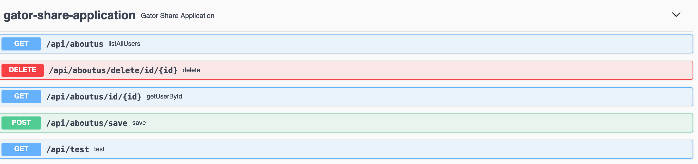

# Getting Started with Spring Boot:
In the project directory run: 

### `mvn spring-boot:run`

Open the browser and type [http://localhost:5000](http://localhost:5000)

# Then retrieved data from database as a form of JSON will be displayed in the browser. 

# These are the API endpoints for the about me page.

